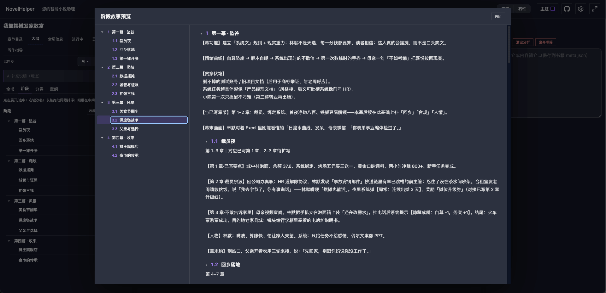
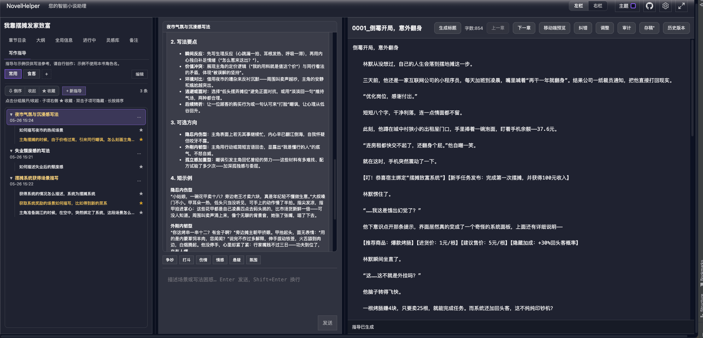
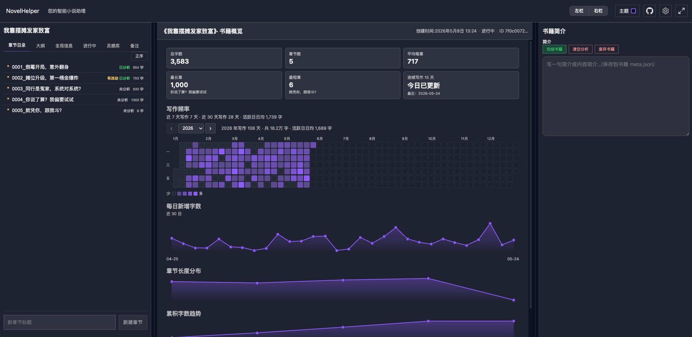

# novelHelper

**本地优先的长篇写作工作台** —— 在浏览器里写章节、管设定、做章节分析；正文与资料以 Markdown / JSON 落在你的硬盘上，不绑网盘账号，AI 可选、可换、可本地。

适合：网文 / 长篇连载作者、想自己掌控稿件与设定文件的写作者、希望用 AI 辅助校对与分析、但不想把书稿交给单一云笔记的人。

---

## 为什么做这个项目

很多写作工具要么偏「在线文档」，要么偏「纯编辑器」，长篇创作还缺一层：**章节 + 设定 + 大纲 + 按章分析** 放在一起，且数据能直接拷贝、备份、管理。

novelHelper 的定位是：

- **本地文件即数据源**：每本书一个文件夹，章节是 `.md`，设定与审计结果在书目录内，换电脑拷文件夹即可。
- **AI 是插件，不是前提**：不配模型也能正常写作、整理；配好后可用本章分析、纠错、新书规划、大纲扩写等。
- **为连载流程设计**：书架多书、章节目录、历史存稿对照、写作统计、时间线与伏笔整理，都围绕「一章一章写下去」展开。

---

## 亮点一览

| 能力 | 说明 |
| --- | --- |
| 章节写作 | 自动保存、全屏与侧栏折叠、章节历史稿对照 / 还原 |
| 新书规划 | 分步填梗概与主线，可 AI 辅助，定稿后一键建书 |
| 大纲 | 全书 / 分卷 / 章纲 / 主线阶段树（任意深度子阶段，中间区大编辑区写细纲），支持 AI 扩写、反推、伏笔检查 |
| 写作指导 | 场景技法顾问：不传本书信息，多笔记本 + 多轮追问，左栏轮次树、星标与隐藏 |
| 本章分析 | 流式输出分析结论，换章浏览不中断进行中的任务 |
| 审计阅读 | 正文高亮人物、地点等，点击跳转设定详情 |
| 纠错对照 | 左右对照改错别字与标点，原文跟当前编辑器，支持同步滚动 |
| 设定库 | 角色、地点、组织等，多来自章节审计后的结构化整理 |
| 写作统计 | 日更字数、热力图、停更提醒等 |
| 模拟评论 | 百种读者人格自动生成章节评论，支持主评、楼中楼及回复互动，全方位测试剧情与挖掘漏洞 |
| 模型配置 | 支持常见 API 与 Ollama 本地模型，测试通过后再启用 AI 功能 |

---

## 部分功能截图

### 本章分析

选中章节后一键发起 **本章分析**：AI 结合本书上下文流式输出叙事张力、人物动机、节奏等结论。切换到其他章节浏览时，进行中的分析 **不会被打断**，适合连写多章时批量扫稿。


### 审计阅读

开启 **审计模式** 后，正文里的人物、地点等实体会高亮；点击即可在侧栏打开对应设定卡，方便边写边核对「谁在哪、是否前后一致」。高亮与索引来自章节审计结果，可随章更新。


### 纠错对照

**纠错** 采用左右对照：左侧为 AI 标注后的文本，右侧跟当前编辑器原文，支持 **同步滚动**。改的是错别字、标点和语法类问题，满意后一键写回正文，不替代你自己的改写判断。


### 大纲 · 阶段细纲

**阶段** 用可无限嵌套的树管理主线细纲（如 `1 → 1.1 → 1.2`）。中间区左侧写该阶段备注，右侧可与 AI **阶段策划** 多轮讨论（自动带入本书梗概与当前阶段）。工具栏 **预览** 在超大弹窗里通读全书阶段：左树右文、编号对齐，点标题可折叠整支子阶段，适合截图展示长篇结构。



### 写作指导

**写作指导** 是独立的场景技法顾问：**不向模型提供任何本书信息**（无章节、设定、角色名），适合问「刀伤怎么写」「争吵怎么铺」这类泛场景问题。左栏为 **指导 → 轮次** 树，中栏多轮对话 + 快捷标签；进入该模式后中间仍可写正文，右栏自动收窄方便对照。数据按书保存在本地 `writing-guidance/`。



### 写作统计 · 热力图

**统计** 页汇总日更字数、连续写作天数等；热力图一眼看出哪些日期写了、哪些天断更，方便连载时自我督促。



### 模拟评论

开启 **模拟评论** 后，存稿会自动引入上百种读者人格，从不同视角在后台生成每章评论（条数可配置）。你可以像真实评论区一样查看主评与楼中楼并进行回复互动，借此全方位测试剧情，提前挖掘隐藏漏洞。


---

## 快速开始

### 环境要求

- Node.js **18+**
- [pnpm](https://pnpm.io)（推荐）

### 安装与运行

1. 克隆仓库并进入目录：

   ```bash
   git clone https://github.com/XFSeven7/novel-helper.git
   cd novel-helper
   ```

2. 安装依赖并启动：

   ```bash
   pnpm install
   pnpm dev
   ```

### 访问地址

| 服务 | 地址 | 说明 |
| --- | --- | --- |
| 前端 | http://127.0.0.1:5177 | 浏览器打开，进入写作界面 |
| API | http://127.0.0.1:3177 | 由 `pnpm dev` 自动拉起，一般无需单独访问 |

### 开发时重启

改完代码若页面未热更新，在项目根目录执行：

```bash
pnpm dev:restart
```

---

## 功能说明（按使用场景）

### 写正文

- 书架新建或打开书籍；进入书后左侧默认在 **「章节目录」**。
- 中间编辑正文，自动保存；顶栏可全屏（全屏时顶栏显示当前时间 `HH:mm`），左右栏可收起。
- 可为章节 **存历史稿**，日后对照或还原。

### 开书前先规划

- 书架 **「新书规划」**：按步骤填写梗概、主线阶段等，也可由 AI 辅助（需先在设置中配置模型）。
- 支持多条规划并行，定稿后再创建书籍；建书后可回顾规划并同步到简介、大纲。

### 大纲

- 左侧 **「大纲」**：全书梗概、分卷、章纲、**阶段**（主线细纲）。
- **阶段** Tab：左侧为可展开的阶段树（支持任意深度子阶段）；选中节点后，**中间正文区**左右分栏——左侧编辑细纲备注，右侧与 AI **阶段策划** 多轮对话（带入本书梗概与阶段上下文）。工具栏 **预览** 可在超大弹窗中通读全部阶段（左右均显示 `1 / 1.1` 编号；点标题可折叠整支子阶段）。另提供 **展开 / 收起**、新建根阶段与子阶段；可长按同级拖动排序。
- 支持 AI 扩写、反推、章纲、伏笔检查等（需模型）。

### 写作指导

- 左侧 **「写作指导」**（在「备注」旁）：向 AI 描述场面或写法问题（如刀伤、争吵怎么铺），获取结构化思路与短示例。
- **不传任何本书信息**（章节、设定、大纲、角色名等）；示例仅用「甲 / 乙」等泛称。
- 多笔记本管理；每条 **指导** 为一组完整多轮对话。左栏为 **指导 → 轮次** 树：点击轮次跳到对应对答；支持 **★ 收藏** 筛选、**双击隐藏** 某轮、**展开 / 收起** 列表分组。
- 进入写作指导时：左栏为目录与中栏对话区，中间仍可写章节，右栏自动收窄以便对照正文。
- 数据存于该书目录 `writing-guidance/index.json`。

### 随手备注

- 左侧 **「备注」**：多笔记本式标签页（默认「规划」不可删）。
- **Enter** 保存，**Shift+Enter** 换行；支持置顶、排序、改名。

### 设定与灵感

- **全局信息**：角色、地点、组织等（多来自章节审计整理）。
- **灵感库**：名字与设定碎片，带回收站。
- **进行中**：审计相关待办一览。
- **统计**：日更、热力图、停更提醒等。

### 单章工具

- **本章分析**：AI 读当前章并流式输出；换章不中断其他章正在跑的分析。
- **审计模式**：正文高亮实体，点击跳转右侧详情。
- **纠错 / 调整**：纠错对照改错别字、标点与语法（原文为当前编辑器内容，左右同步滚动）；调整用于增删字数，满意后一键写回正文。
- **时间线**：章摘要、多章合并摘要、事件完成标记等。

### 设置

- **模型**：配置各家 API 或 Ollama，测试通过后再用分析、纠错、规划等功能。
- **数据目录**：指定书稿存放路径，可迁移到新的空目录。

---

## 数据存在哪里

默认使用仓库内 `book/`。可在 **设置 → 数据目录** 改为任意本机路径。

每本书一个子目录，典型内容包括：

- `chapters/*.md` — 章节正文
- `meta.json` — 书名、简介等
- `story/` — 大纲、角色卡、世界观等
- 审计索引、写作统计、备注、`writing-guidance/`（写作指导）等辅助文件

**备份与迁移**：拷贝整个数据目录即可；也可用 Git 对书稿目录做版本管理（注意 `.gitignore` 与隐私）。

---

## 技术栈

| 层级 | 技术 |
| --- | --- |
| 前端 | React、Vite |
| 后端 | Node.js、Fastify |
| AI | Vercel AI SDK，兼容 OpenAI 及 OpenAI-compatible 接口 |
| 包管理 | pnpm workspace（`packages/ui`、`packages/server`、`packages/cli`） |

---
