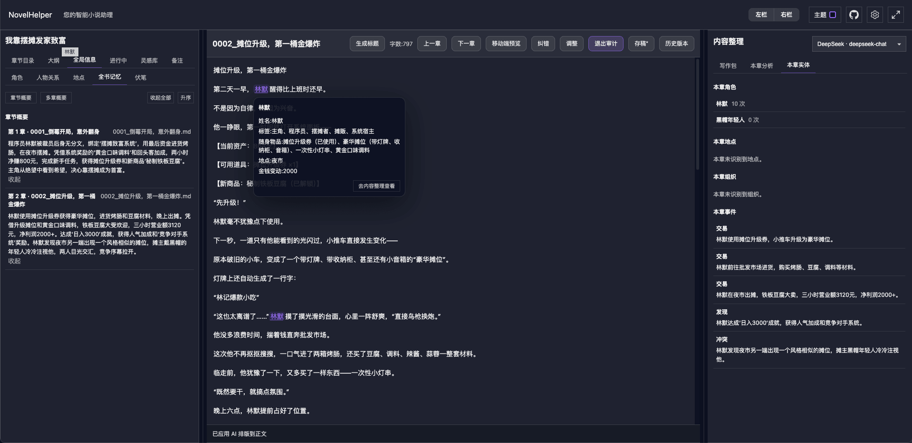

# novelHelper

本项目是一个 **本地写小说的网页端**：在网页里新建/编辑章节与状态卡，服务端会把内容写到你电脑的本地文件夹里（Markdown）。

## 功能概览

### 写作与资料
- **书架**：新建/打开书籍；查看书籍简介；显示缺失章节序号并支持补齐。
- **章节编辑**：在网页中直接编辑章节正文（自动保存到本地 Markdown 文件）。
- **资料卡（story）**：管理全书资料（包括角色卡文件等），同样落盘为 Markdown。
- **全屏**：顶部支持全屏切换。

### 分析 / 审计 / 内容整理
- **本章分析（流式）**：对当前章节进行 AI 分析（SSE 流式输出）。
  - **5 步进度提示**：展示当前执行到第几步（避免误以为卡住）。
  - **分析不中断**：切换到其他章节浏览时，当前分析不会中断；其他章节会提示“某章正在分析中”，可一键跳回。
  - **分析记录落盘**：分析内容会按章节保存，刷新/切章后可恢复展示。
- **审计阅读模式**：只读渲染正文；对“内容整理对象”（角色/地点/组织/全书记忆事件/资料）做低密度高亮；
  - 悬浮显示对象信息卡片
  - 点击可跳转到右侧内容整理并定位/展开对应对象
- **角色库（全书共享）**：来源于审计结果沉淀，支持隐藏/取消隐藏、编辑角色属性（身份/标签/状态/性格分析）。
  - **搜索（模糊匹配）**：支持按 名字/身份/标签 搜索；搜索框吸顶常驻。
- **地点库（全书共享）**：来源于审计结果沉淀，支持分组、折叠、隐藏/编辑（描述/发生的事简述）。
- **组织库（全书共享）**：来源于审计事件抽取沉淀，支持隐藏/编辑（描述/动态简述）。

## 截图与演示

### 分析功能


### 审计功能（PNG）



### 润色功能（PNG）


### 写作与资料
（见上方“功能概览”。）

### 时间线
- **每章摘要**：每章审计完成后生成并展示。
- **压缩区间摘要**：可把 N 章摘要压缩成一个区间摘要；支持再次压缩/迭代压缩。
- **事件列表**：支持标记“完成”，可按开关隐藏已完成事件。
- **推荐压缩区间**：AI 会给出适合压缩的章节区间建议。

### 润色与扩写
- **润色（对照）**：一键润色当前章节，编辑区切换为左右对照（左原文/右润色稿），支持“一键更换”；并能标记润色稿中改动片段。
- **快速扩写（对照）**：输入目标字数与补充信息后扩写正文；自动把时间线“压缩摘要”投喂给模型作为上下文；编辑区左右对照（左原文/右扩写稿），支持“一键更换”。

## 开发启动

### 1) 安装依赖

```bash
pnpm install
```

### 2) 启动服务端 + 网页端

```bash
pnpm dev
```

- UI: `http://127.0.0.1:5177`
- Server: `http://127.0.0.1:3177`

## 生产使用（本地运行）

如果你只是想本地使用（不是开发）：

```bash
pnpm install
pnpm build
pnpm dev
```

## 模型配置（AI）

- 在网页右侧的 **“模型配置”** 中添加并测试模型连接，通过后即可用于：分析/审计/润色/扩写/时间线压缩等能力。
- 支持多种 provider（OpenAI / DeepSeek / Ollama / Custom 等），其中：
  - **Ollama**：走 OpenAI 兼容 `/v1` 接口（便于稳定流式输出）。

## 本地文件落盘位置

默认写到仓库根目录下：

- `book/<bookSlug>/meta.json`
- `book/<bookSlug>/chapters/*.md`
- `book/<bookSlug>/story/*.md`
- `book/<bookSlug>/story/characters/*.md`（角色卡一人一文件）
- `book/<bookSlug>/meta/audit/*`（审计与索引：角色/地点/组织/时间线等）
- `book/<bookSlug>/meta/audit/analysisTexts/*.md`（本章分析：按章节保存的分析过程文本）

也可以通过环境变量指定：

```bash
NOVEL_HELPER_DATA_DIR="/你的/写作目录" pnpm -C packages/server dev
```

## 常见操作（快速上手）

- **新建一本书**：进入书架 → 新建书籍 → 选择书名/简介。
- **新建章节**：进入某本书 → 左侧空缺提示或章节列表 → 新建章节 → 在中间编辑正文。
- **开始分析/审计**：右侧「本章分析」→ 开始分析（右侧内容整理会随审计产物刷新）。
- **审计阅读模式**：点击“审计”→ 在正文里查看高亮 → 悬浮看详情 → 点击跳转到内容整理。
- **润色**：点击“润色”→ 生成后用“一键更换”替换正文。
- **扩写**：点击“扩写”→ 输入目标字数/补充信息 → 开始扩写 → 对照确认后“一键更换”。

## 许可

仅供本地写作与学习使用；如需商用或开源许可请自行补充声明。

